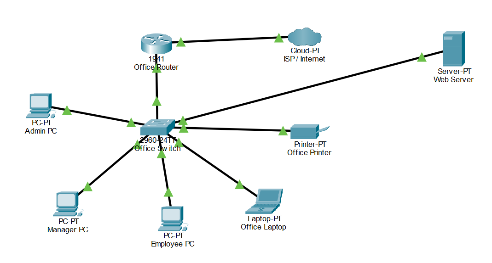
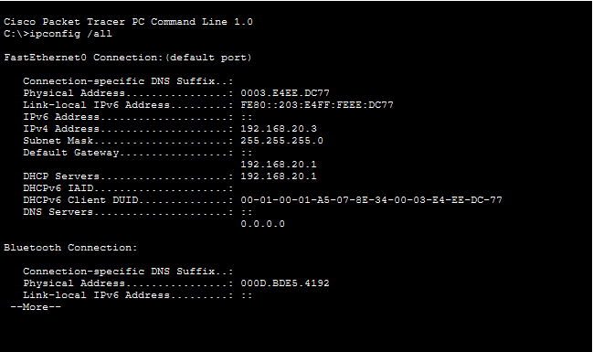
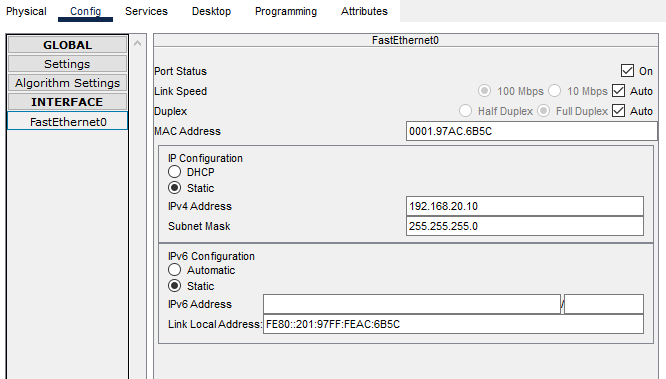
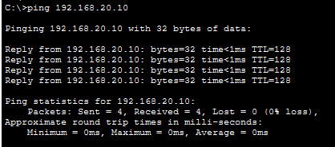
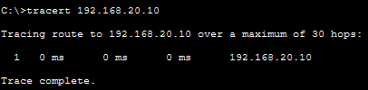

# Small Office LAN 

## Project Overview 📌

This project is a beginner-level **Small Office LAN** designed and configured using **Cisco Packet Tracer**.

The network simulates a small office environment containing multiple computers, a laptop, a network printer and a web server. A Cisco router and switch provide connectivity and network management within the office.

The project demonstrates basic networking concepts including **LAN design, IP addressing, DHCP, default gateways, web server configuration, connectivity testing and basic network troubleshooting**.

---

## Objectives 🎯

* Design a functional Small Office LAN in Cisco Packet Tracer.
* Connect multiple end devices through a network switch.
* Configure a Cisco router as the LAN gateway.
* Configure DHCP for automatic IP addressing.
* Configure a web server and enable HTTP.
* Test connectivity between network devices.
* Use basic networking commands such as `ipconfig`, `ipconfig /all`, `ping` and `tracert`.
* Troubleshoot common network configuration issues.

---

## Tools Used 🧰

* **Cisco Packet Tracer**
* **Cisco IOS CLI**
* IPv4 networking
* DHCP
* HTTP

---

## Network Topology 🖥️

The final network consists of:

* ISP/Internet Cloud
* Office Router
* Office Switch
* Admin PC
* Manager PC
* Employee PC
* Office Laptop
* Office Printer
* Web Server

### Topology Diagram



---

## Device Connections 🔌

| Device         | Interface     | Connected To       | Interface              |
| -------------- | ------------- | ------------------ | ---------------------- |
| Office Router  | G0/0          | ISP/Internet Cloud | Ethernet               |
| Office Router  | G0/1          | Office Switch      | G0/1                   |
| Admin PC       | FastEthernet0 | Office Switch      | F0/1                   |
| Manager PC     | FastEthernet0 | Office Switch      | F0/2                   |
| Employee PC    | FastEthernet0 | Office Switch      | Free FastEthernet port |
| Office Laptop  | FastEthernet0 | Office Switch      | Free FastEthernet port |
| Office Printer | FastEthernet0 | Office Switch      | F0/24                  |
| Web Server     | FastEthernet0 | Office Switch      | F0/3                   |

All Ethernet connections between the office devices use **copper straight-through cables**.

---

## IP Addressing 🌐

The internal office LAN uses the private IPv4 network:

```text
Network:       192.168.20.0/24
Subnet Mask:   255.255.255.0
Default Gateway: 192.168.20.1
```

The Office Router's LAN interface is configured as:

```text
GigabitEthernet0/1
IP Address: 192.168.20.1
```

The Web Server uses:

```text
IP Address:    192.168.20.10
Subnet Mask:   255.255.255.0
Default Gateway: 192.168.20.1
```

Other office devices receive their IP configuration automatically through DHCP.

---

## DHCP Configuration 📡

The Office Router was configured to provide **DHCP (Dynamic Host Configuration Protocol)** services to the office LAN.

DHCP allows devices to automatically receive network configuration instead of requiring every device to be configured manually.

For example, the Admin PC received:

```text
IPv4 Address:    192.168.20.2
Subnet Mask:     255.255.255.0
Default Gateway: 192.168.20.1
DHCP Server:     192.168.20.1
```

### DHCP Verification

The `ipconfig /all` command was used to verify the configuration.



---

## 🌐 Web Server

A Web Server was added to the office LAN and configured with a static IP address.

```text
IP Address:       192.168.20.10
Subnet Mask:      255.255.255.0
Default Gateway: 192.168.20.1
```

The **HTTP service was enabled** on the server so that clients on the LAN could access the hosted webpage.



---

## Connectivity Testing 🧪

Several networking commands were used to test and understand the network.

### `ipconfig`

The `ipconfig` command was used to view the basic IPv4 configuration of a host, including its IP address, subnet mask, and default gateway.

### `ipconfig /all`

The `ipconfig /all` command provided additional information such as:

* MAC address
* DHCP server
* DNS server
* IPv6 information
* Detailed network adapter information

### `ping`

The `ping` command was used to test connectivity between devices, including the PC and the router and the PC and Web Server.


### `tracert`

The following command was used:

```text
tracert 192.168.20.10
```

The result showed the Web Server directly as the first and only hop.


This occurred because the PC and Web Server are both located on the same `192.168.20.0/24` LAN. Therefore, the traffic does not need to pass through the router to reach the Web Server.

---

## Troubleshooting 🛠️

During the project, several configuration issues were encountered and resolved.

### DHCP Failure and APIPA

Initially, the PCs failed to obtain an IP address through DHCP and displayed:

```text
DHCP request failed. APIPA is being used.
```

The router's LAN interface was checked and configured correctly. After assigning the appropriate LAN address and correcting the DHCP configuration, the PCs successfully received addresses from the router.

### Subnet Overlap

An incorrect attempt to assign an address from the `192.168.10.0` network to another router interface resulted in:

```text
% 192.168.10.0 overlaps with GigabitEthernet0/0
```

The LAN was then configured using the separate `192.168.20.0/24` network, while the router's other interface remained on the `192.168.10.0` network.

This demonstrated the importance of using **different subnets for different router interfaces**.

### Router Interfaces

The router interfaces initially required activation. The Cisco IOS `no shutdown` command was used to enable the required interfaces and establish the connections.

---

## Key Concepts Learned 🧠

Through this project, I practiced and learned:

* LAN architecture
* Cisco Packet Tracer
* Routers and switches
* IPv4 addressing
* Private IP addresses
* Subnet masks and `/24` networks
* Default gateways
* DHCP
* MAC addresses
* HTTP/Web servers
* Ethernet connections
* Cisco IOS configuration
* `ipconfig`
* `ipconfig /all`
* `ping`
* `tracert`
* APIPA
* Basic network troubleshooting
* Same-subnet communication

---

## Project Status ✅

**Completed**

The Small Office LAN was successfully designed, configured, tested and documented in Cisco Packet Tracer.

This project was created as part of my practical networking learning and portfolio development.
